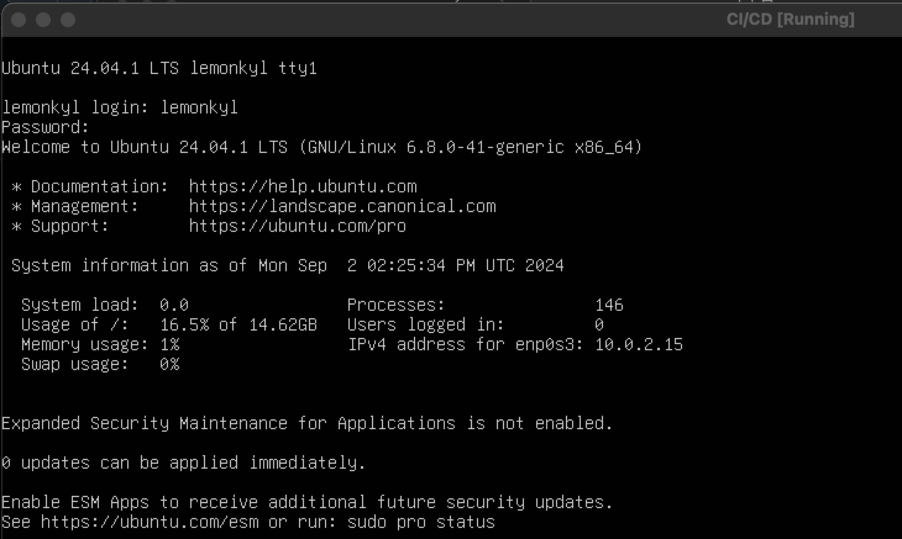
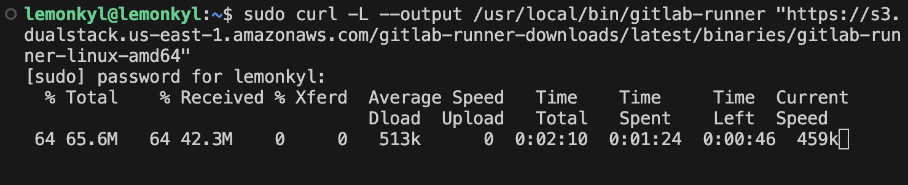
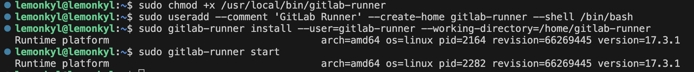
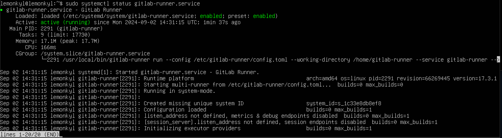
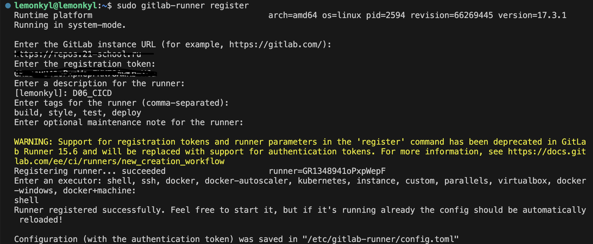
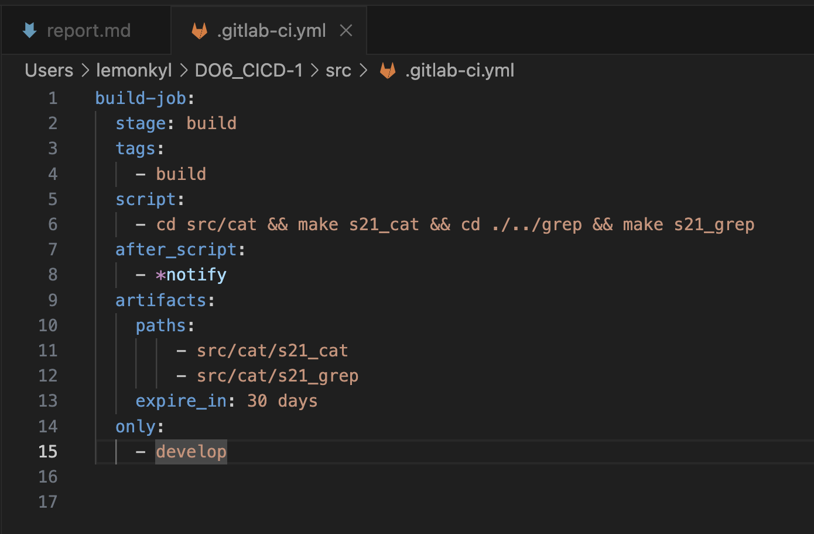
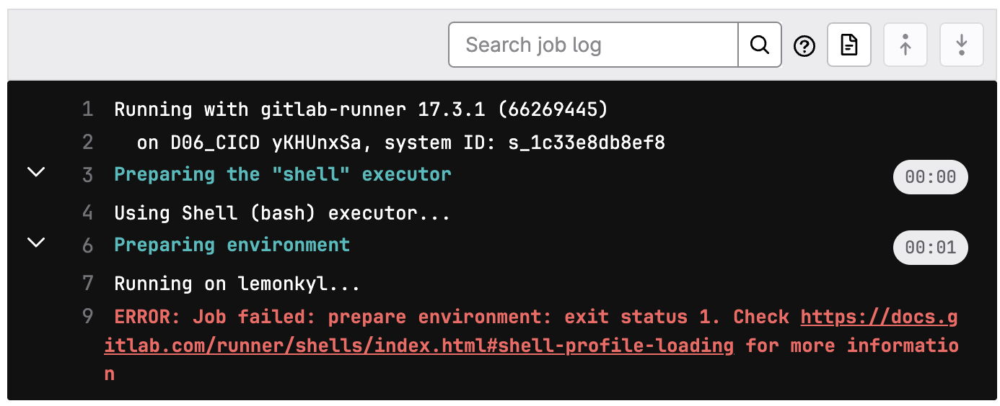

## Part 1. Настройка gitlab-runner

+ Подними виртуальную машину Ubuntu Server 22.04 LTS.

Будь готов, что в конце проекта нужно будет сохранить дамп образа виртуальной машины.

+ Скачай и установи на виртуальную машину gitlab-runner.

Для установки использую команду `sudo curl -L --output /usr/local/bin/gitlab-runner "https://s3.dualstack.us-east-1.amazonaws.com/gitlab-runner-downloads/latest/binaries/gitlab-runner-linux-amd64"` вместе с бинарной ссылкой, взятой с официального сайта:
  
Добавляю права, создаю пользователя, устанавливаю, как службу и запускаю через команды, указанные на скрине:
  
Затем проверяю статус программы через `sudo systemctl status gitlab-runner.service`:

+ Запусти gitlab-runner и зарегистрируй его для использования в текущем проекте (DO6_CICD).

Использую команду `sudo gitlab-runner register`:
  
В регистрации использую те же данные, что прикреплены к моему проекту - ссылку и токен, а далее прописываю теги. Всё это указано на скрине выше.

## Part 2. Сборка
+ Напиши этап для CI по сборке приложений из проекта C2_SimpleBashUtils.

1) В файле gitlab-ci.yml добавь этап запуска сборки через мейк файл из проекта C2.
2) Файлы, полученные после сборки (артефакты), сохрани в произвольную директорию со сроком хранения 30 дней.

Создаём файл в корне репозитория через команду `touch` и прописываем этап запуска через мэйк:

Выходит ошибка:  
  
Исправляемм её:

## Part 3. Тест кодстайла
+ Напиши этап для CI, который запускает скрипт кодстайла (clang-format).

1) Если кодстайл не прошел, то «зафейли» пайплайн.
2) В пайплайне отобрази вывод утилиты clang-format.

## Part 4. Интеграционные тесты
+ Напиши этап для CI, который запускает твои интеграционные тесты из того же проекта.

1) Запусти этот этап автоматически только при условии, если сборка и тест кодстайла прошли успешно.
2) Если тесты не прошли, то «зафейли» пайплайн.
3) В пайплайне отобрази вывод, что интеграционные тесты успешно прошли / провалились.

## Part 5. Этап деплоя
+ Подними вторую виртуальную машину Ubuntu Server 22.04 LTS.

+ Напиши этап для CD, который «разворачивает» проект на другой виртуальной машине.

+ Запусти этот этап вручную при условии, что все предыдущие этапы прошли успешно.

+ Напиши bash-скрипт, который при помощи ssh и scp копирует файлы, полученные после сборки (артефакты), в директорию /usr/local/bin второй виртуальной машины.
Тут тебе могут помочь знания, полученные в проекте DO2_LinuxNetwork.

+ В файле gitlab-ci.yml добавь этап запуска написанного скрипта.

+ В случае ошибки «зафейли» пайплайн.

+ Сохрани дампы образов виртуальных машин.

(Не забудь запустить пайплайн с последним коммитом в репозитории).

## Part 6. Дополнительно. Уведомления
+ Настрой уведомления об успешном/неуспешном выполнении пайплайна через бота с именем «[твой nickname] DO6 CI/CD» в Telegram.

Текст уведомления должен содержать информацию об успешности прохождения как этапа CI, так и этапа CD.
В остальном текст уведомления может быть произвольным.

## Итоговый файл со всеми сделанными этапами задания находится в папке src и и имеет название .gitlab-ci.yml

Все этапы проходят успешно.

